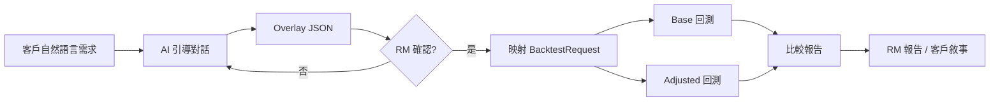

# JASPER Conversational Overlay 流程設計

>
>
> **版本**：1.2（PoC — **基準客製化 / Benchmark Personalization**）  
> **適用場景**：私人銀行 RM 以自然語言捕捉客戶需求，經 AI 引導對話結構化為 **Overlay JSON**，再映射至 `BacktestRequest` 執行「**Anchor（基準）vs Customized（客製化配置）**」並列回測（例：「標普 500 客製版」「Classic 60/40 客製版」），產出機構級 RM 報告。  
> **設計原則**：AI 只負責**萃取與確認**客戶意圖，不產生自由下單指令；所有績效數字由量化引擎計算。  
> **產品敘事**：Universe = 主流 ETF 積木（SPY、QQQ、AGG、IWM、GLD…）；**Anchor（基準配置）** = RM 選定之 model portfolio（例：SPY／標普 500、QQQ、Classic 60/40）；RM 描述客戶需求 → JASPER 輸出 **客製化配置（Customized Portfolio）** → 驗證 = **基準 vs 客製化** 並列比較。UI 可顯示「客製化配置 vs {錨點顯示名}」。**勿**以「SPY V2」作為通用產品名。

---

## 1. 使用者旅程（RM 步驟）


| 步驟                | RM 行為                            | 系統行為                                                          | 產出                                   |
| ----------------- | -------------------------------- | ------------------------------------------------------------- | ------------------------------------ |
| **0. 選擇基準配置**   | 選 SPY、經典 60/40 等模型組合作 Anchor     | 載入 `model-portfolios`、限制示範 Universe 為主流 ETF                  | `anchor-{id}` 基準回測請求草稿              |
| **0b. 開啟 session** | 以自然語言描述客戶情境（可選略過）              | 建立 `session_id`、phase=`discovery`                        | 空白 Overlay 草稿                        |
| **1. 需求探索**       | 以口語描述客戶情境（流動性、集中度、市場擔憂）          | AI 多輪追問、標記已確認／待澄清欄位                                           | `clarification_questions`、部分 Overlay |
| **2. 結構化確認**      | 檢視「AI 理解的 overlay」摘要卡，修正欄位       | 顯示映射預覽（資產類別、universe 規則、槽位權重）                                 | phase=`confirm`                      |
| **3. RM 簽核**      | 點選「確認並執行回測」、可附註                  | 寫入 `rm_sign_off`、鎖定 Overlay 版本                                | 不可變 overlay snapshot                 |
| **4. 雙軌回測**       | 等待引擎完成                           | **Anchor（基準）**：機構模型／選定錨點；**Customized（客製化）**：Overlay 映射的 `BacktestRequest` | 兩份 `BacktestResult`                  |
| **5. 檢視報告**       | 比較 **基準 vs 客製化**、編輯敘事要點       | Institutional Report + AI 敘事（`narrative_facts` 校驗）            | RM 簡報素材                              |
| **6. 客戶簡報**       | 匯出／共閱（i18n）                      | 審計軌跡保留 overlay + sign-off + job_id                            | 合規可追溯                                |





---


## 2. 對話階段（Conversation Phases）


| Phase         | 目的          | AI 行為                  | 退出條件                         |
| ------------- | ----------- | ---------------------- | ---------------------------- |
| **discovery** | 廣泛收集客戶輪廓與痛點 | 開放式提問、歸納主題標籤           | 至少涵蓋風險取向 + 一項具體需求            |
| **clarify**   | 填補結構化欄位缺口   | 針對缺失欄位提問（金額、時間、曝險上限）   | `confidence ≥ 0.7` 或 RM 手動補齊 |
| **confirm**   | 人機對齊        | 輸出繁中摘要 + 待確認清單         | RM 點選確認                      |
| **execute**   | 觸發回測        | 不再修改 overlay；顯示 job 進度 | 雙 job 均 `completed`          |
| **review**    | 解讀結果        | 僅生成敘事與比較要點（引用引擎數字）     | RM 標記 session 結案             |


**Phase 轉換規則**：

- `discovery` → `clarify`：首次 `/api/overlay/interpret` 回傳 `clarification_questions.length > 0`
- `clarify` → `confirm`：`confidence ≥ 0.7` 且無未答問題
- `confirm` → `execute`：`rm_sign_off` 寫入
- `execute` → `review`：adjusted job 完成

---


## 3. 範例對話（三種情境）


### 3.1 流動性需求（Liquidity Need）

```
RM：這位客戶 58 歲，風險中等，明年 Q2 需要約 80 萬美元買第二間房，目前組合偏股。

AI：了解。為規劃流動性，請確認：(1) 80 萬是淨提領還是含稅總額？(2) 可接受賣出比例上限？

RM：淨額 80 萬，希望 12 個月內備妥，賣出不超過組合 15%。

AI：建議 overlay：債券槽位提高至 35%、增配短天期／浮動利率標的、單一標的上限 8%。
    待確認：是否排除 HY 債？

RM：是，暫時不要高收益債。確認。

→ Overlay：liquidity_need { within_months: 12, amount_usd: 800000 }
→ allocation.sleeve_targets { w_bond: 0.35, w_equity: 0.50, w_commodity: 0.05, w_real_estate: 0.10 }
→ universe.prompts: ["short duration and floating rate bond ETFs", "exclude high yield credit"]
→ objective: min_max_drawdown
```


### 3.2 科技股集中度（Tech Concentration）

```
RM：客戶 NASDAQ 曝險約 42%，擔心 AI 泡沫，想降科技但保留成長。

AI：目前集中度超過一般建議。您希望 (1) 科技曝險上限？(2) 是否用因子／低波替代？

RM：科技相關不超過 25%，可用品質和低波因子，保留美國成長但分散產業。

AI：建議：universe 規則限制科技類 ETF；w_equity_us 維持、增配 w_lowvol；max_weight 10%。

RM：確認，並用 regime 自適應。

→ universe.prompts: ["US quality and low volatility equity", "cap technology sector exposure"]
→ param_adjustments.w_lowvol: { mode: "search", min: 0.3, max: 1.2 }
→ optimization.regime_adaptive: true
→ optimization.objective: max_sharpe
```


### 3.3 風險趨避擔憂（Risk-off Concern）

```
RM：客戶看到地緣新聞很緊張，問要不要全轉債券。風險偏保守。

AI：不建議「全轉債」式極端配置。是否接受股債 30/60 防禦型、另類 10% 對沖？

RM：可以，但要 TIPS 和黃金一點，股票不要太小盤。

AI：overlay 草案：risk_off stance、min_max_drawdown、commodity  precious 5%、實驗性 regime risk_off。

RM：確認執行，跟現行模型組合比較。

→ market_view.stance: risk_off
→ experiment: { enabled: true, regime_mode: "risk_off" }
→ allocation.asset_classes: [equity, bond, commodity, alternative]
→ 雙軌：base=現行 model portfolio scenario_id；adjusted=overlay 映射
```

---


## 4. Overlay JSON Schema（完整欄位定義）

實作見 `apps/web/src/lib/overlay-schema.ts`。摘要如下：

### 4.1 根物件 `ClientOverlay`（version `1.0`）


| 欄位                        | 型別                             | 必填  | 說明               |
| ------------------------- | ------------------------------ | --- | ---------------- |
| `version`                 | `"1.0"`                        | ✓   | Schema 版本        |
| `audit`                   | `OverlaySessionAudit`          | ✓   | Session 與合規審計    |
| `client_profile`          | `ClientProfileOverlay`         | ✓   | 客戶輪廓（去識別化）       |
| `market_view`             | `MarketViewOverlay`            | ✓   | 市場觀點與敘事          |
| `allocation`              | `AllocationOverlay`            | ✓   | 資產類別與槽位          |
| `universe`                | `UniverseRuleOverlay`          | ✓   | 標的池 AI 規則        |
| `optimization`            | `OptimizationOverlay`          | ✓   | 目標函數與優化模式        |
| `param_adjustments`       | `Record<string, ParamControl>` |     | 因子／槽位參數覆寫        |
| `experiment`              | `ExperimentRequest`            |     | Regime 實驗開關      |
| `clarification_questions` | `string[]`                     |     | 待 RM／客戶回答        |
| `confidence`              | `number` 0–1                   | ✓   | AI 對結構化完整度評分     |
| `rationale`               | `string`                       | ✓   | AI 繁中摘要（給 RM 確認） |


### 4.2 `OverlaySessionAudit`


| 欄位                                | 型別                              | 說明                 |
| --------------------------------- | ------------------------------- | ------------------ |
| `session_id`                      | `string`                        | UUID               |
| `rm_id`                           | `string?`                       | RM 員工編號（機構 SSO）    |
| `client_ref`                      | `string?`                       | 假名化客戶參考（非 PII）     |
| `created_at` / `updated_at`       | ISO8601                         | 時間戳                |
| `phase`                           | `OverlayPhase`                  | 當前對話階段             |
| `conversation_turns`              | `number`                        | 訊息輪數               |
| `source`                          | `"gemini" | "rules" | "manual"` | 萃取來源               |
| `rm_sign_off`                     | `{ signed_at, rm_id, note? }?`  | RM 簽核（execute 前必填） |
| `base_scenario_id`                | `string?`                       | 基準回測情境 ID          |
| `base_job_id` / `adjusted_job_id` | `string?`                       | 雙軌 job 參照          |


### 4.3 `ClientProfileOverlay`


| 欄位                             | 說明                                     |
| ------------------------------ | -------------------------------------- |
| `risk_tolerance`               | `conservative | moderate | aggressive` |
| `investment_horizon_years`     | 投資年限                                   |
| `liquidity_need.amount_usd`    | 預計提領金額（USD）                            |
| `liquidity_need.within_months` | 幾個月內需要                                 |
| `liquidity_need.description`   | 自由文字（購屋、學費等）                           |
| `esg_preference`               | `none | light | strict`                |
| `income_need_pct`              | 年化現金流需求佔組合 %                           |


### 4.4 `MarketViewOverlay`


| 欄位                  | 說明                                         |
| ------------------- | ------------------------------------------ |
| `stance`            | `risk_on | neutral | risk_off`             |
| `themes`            | 主題標籤（inflation, geopolitics, tech_bubble…） |
| `narrative_summary` | 一兩句市場觀點摘要                                  |


### 4.5 `AllocationOverlay`


| 欄位                        | 說明                                                 |
| ------------------------- | -------------------------------------------------- |
| `asset_classes`           | `AssetClass[]` — 啟用資產類別                            |
| `sleeve_targets`          | `w_equity`, `w_bond`… 頂層槽位目標（0–1）                  |
| `sub_sleeve_targets`      | `w_equity_us`, `w_bond_us`… 區域子權重                  |
| `enforce_class_weights`   | 是否硬約束槽位（→ `BacktestRequest.enforce_class_weights`） |
| `max_single_position_pct` | 單一標的上限（→ `max_weight`）                             |


### 4.6 `UniverseRuleOverlay`


| 欄位                   | 說明                                        |
| -------------------- | ----------------------------------------- |
| `prompts`            | 自然語言規則（→ `universe_filter_prompts`）       |
| `supplement_tickers` | 明確補充 ETF（→ `universe_supplement_tickers`） |
| `exclude_tickers`    | PoC 記錄用；Phase 2 引擎支援                      |


### 4.7 `OptimizationOverlay`


| 欄位                  | 說明                    |
| ------------------- | --------------------- |
| `objective`         | `Objective` enum      |
| `regime_adaptive`   | Regime 自適應配置          |
| `optimization_mode` | `standard | pro_auto` |
| `trials`            | 試驗次數（可選）              |


---


## 5. 映射表：Overlay → BacktestRequest / 引擎


| Overlay 欄位                           | BacktestRequest / 引擎                              | 轉換邏輯                                            |
| ------------------------------------ | ------------------------------------------------- | ----------------------------------------------- |
| `allocation.asset_classes`           | `asset_classes`                                   | 直接對應；空則沿用 base                                  |
| `allocation.sleeve_targets.*`        | `param_controls[w_*]`                             | `mode: "fixed"` 或 `enforce_class_weights: true` |
| `allocation.sub_sleeve_targets.*`    | `param_controls[w_equity_us…]`                    | 同上                                              |
| `allocation.enforce_class_weights`   | `enforce_class_weights`                           | 布林                                              |
| `allocation.max_single_position_pct` | `max_weight`                                      | 預設 0.10                                         |
| `universe.prompts`                   | `universe_filter_prompts`, `universe_filter_text` | `join("; ")`                                    |
| `universe.supplement_tickers`        | `universe_supplement_tickers`                     | 聯集                                              |
| `optimization.objective`             | `objective`                                       | 直接                                              |
| `optimization.regime_adaptive`       | `regime_adaptive`                                 | 直接                                              |
| `optimization.optimization_mode`     | `optimization_mode`                               | 直接                                              |
| `optimization.trials`                | `trials`                                          | 可選覆寫                                            |
| `param_adjustments`                  | `param_controls`                                  | merge 至 base controls                           |
| `experiment`                         | `experiment`                                      | 直接                                              |
| `market_view.stance: risk_off`       | `experiment.regime_mode`                          | 若未指定 experiment 則推斷                             |
| `client_profile.liquidity_need`      | `objective` 建議                                    | 高流動性 → `min_max_drawdown`                       |
| `audit.base_scenario_id`             | `scenario_id`（base 回測）                            | adjusted 用 overlay 映射 scenario                  |
| `report_language`（API body）          | `report_language`                                 | `zh` / `en` / `ko`                              |


**asset_class_policy（Python）**：`enforce_param_controls_for_asset_classes` 會將未選資產類別的 `w_`* 固定為 0；Overlay 映射後應呼叫與 UI 相同的 `enforceAllocControlsForClasses`。

**Universe filter**：映射後對每條 `universe.prompts` 呼叫 `/api/universe/filter`（與 `AssetClassFilter` 相同），合併 `supplement_tickers`。

---


## 6. AI Prompt 策略（萃取 + 確認，非自由交易）


### 6.1 System Prompt 要點

1. **角色**：私人銀行量化副駕，協助 RM 結構化客戶需求。
2. **禁止**：不得輸出「買入／賣出 X 股」、不得捏造績效、不得繞過 RM 確認。
3. **輸出**：僅 JSON（Zod schema），含 `clarification_questions` 與 `confidence`。
4. **語言**：`rationale` 與追問使用 `report_language`（繁中預設）。
5. **保守預設**：不確定時降低 `confidence`、多問一句，而非猜測權重。


### 6.2 多輪流程

```
messages[] + prior_overlay? → POST /api/overlay/interpret → ClientOverlay
RM 確認 → overlayToBacktestRequest(base, overlay) → POST /api/jobs (adjusted)
並行：base BacktestRequest（機構模板）→ POST /api/jobs (base)
完成後 → /api/narrate + Institutional Report 比較
```


### 6.3 無 API Key 備援

規則式 `interpretOverlayFallback`（關鍵字：流動性、科技、risk-off）— 與 `scenario-fallback` 相同模式。

---


## 7. 合規：RM 簽核與審計

每個 session **必須**持久化（PoC：localStorage / JSON export；量產：機構 DB）：


| 審計欄位                                | 用途             |
| ----------------------------------- | -------------- |
| `session_id`                        | 唯一追蹤           |
| `overlay` snapshot（sign-off 後 hash） | 證明 RM 確認內容     |
| `rm_sign_off`                       | 人審時間與責任歸屬      |
| `conversation_log`                  | 完整對話（去 PII）    |
| `base_job_id` / `adjusted_job_id`   | 關聯引擎產出         |
| `interpret_source`                  | gemini / rules |


**免責**：所有 AI 輸出標示「研究與教育用途，非投資建議」；最終建議須 RM 簽核後方可對客戶口頭或書面傳達。

---


## 8. PoC 範圍 vs Phase 2


| 能力                        | PoC（SFF Hackcelerator）       | Phase 2（量產）      |
| ------------------------- | ---------------------------- | ---------------- |
| **基準配置選擇（Anchor）**       | ✓ `AnchorPortfolioSelector` + `model-portfolios` | 客戶實際持倉／行內模型庫 |
| 對話式 Overlay 萃取            | ✓ `/api/overlay/interpret`   | 多語音／會議記錄匯入       |
| Overlay → BacktestRequest | ✓ `overlayToBacktestRequest` | 與核心銀行帳戶持倉同步      |
| 雙軌 Anchor vs Customized   | ✓ 並行 `createJob` + `BenchmarkComparePanel` | 自動載入客戶實際持倉       |
| RM 簽核 UI                  | ✓ `OverlayConversationPanel`（已接入主精靈） | SSO + 合規系統 API   |
| Session 持久化               | 瀏覽器 / 匯出 JSON                | 機構資料庫 + 保留政策     |
| Universe                  | 328 ETF                      | Julius Baer 產品目錄 |
| 排除標的 `exclude_tickers`    | 僅記錄                          | 引擎層硬排除           |
| 客戶共閱入口                    | RM 匯出 PDF                    | 客戶 Portal + i18n |


---


## 9. PoC 實作順序

1. `overlay-schema.ts` — 型別、Zod、映射函式、驗證
2. `/api/overlay/interpret` — Gemini structured extract + fallback
3. `OverlayConversationPanel.tsx` — 對話 + 摘要卡 + 確認
4. **`AnchorPortfolioSelector` + `page.tsx` 精靈** — 基準 → Overlay → 設定 → 雙軌回測
5. **`BenchmarkComparePanel`** — Anchor vs Customized（基準 vs 客製化）並列指標（CAGR、夏普、回撤）
6. **報告比較視圖** — 並列 institutional metrics（Phase 2）

---


## 10. 相關檔案


| 檔案                                                     | 說明                |
| ------------------------------------------------------ | ----------------- |
| `apps/web/src/lib/overlay-schema.ts`                   | Schema 與映射        |
| `apps/web/src/lib/overlay-fallback.ts`                 | 規則備援              |
| `apps/web/src/lib/model-portfolios.ts`                 | 基準組合、示範 Universe、`buildAnchorBacktestRequest` |
| `apps/web/src/app/api/overlay/interpret/route.ts`      | Interpret API     |
| `apps/web/src/components/OverlayConversationPanel.tsx` | 客戶需求對話 UI        |
| `apps/web/src/components/AnchorPortfolioSelector.tsx`  | 基準配置選擇           |
| `apps/web/src/components/BenchmarkComparePanel.tsx`    | 基準 vs 客製化並列指標    |
| `apps/web/src/app/page.tsx`                            | 主精靈（anchor → overlay → constraints → 雙軌結果） |
| `apps/web/src/lib/types.ts`                            | `BacktestRequest`、`PersonalizationCompare` |
| `apps/web/src/app/api/universe/filter/route.ts`        | Universe 規則解析參考   |


