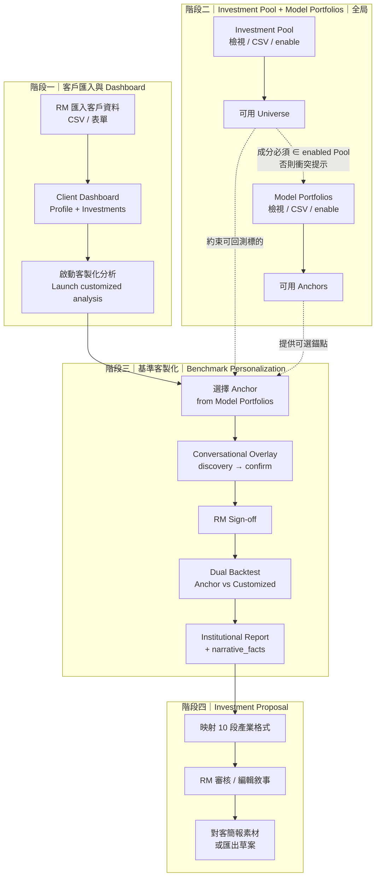
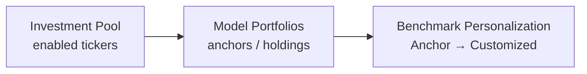

# JASPER AI — RM Wealth-Management Flow Expansion

## Product Specification | 產品規格書

| 欄位 | 內容 |
|------|------|
| **產品** | JASPER AI 智能量化助手 — RM Copilot（理專副駕） |
| **範圍** | 在現有 Conversational Overlay / **Benchmark Personalization（基準客製化）** 流程前後擴充：客戶匯入 → Client Dashboard → Investment Pool → **Model Portfolios** → Overlay 客製化 → Investment Proposal |
| **對象** | Hackcelerator / 私人銀行 RM Demo（SFF 2026） |
| **文件狀態** | 產品規格（**僅文件**；本階段不實作程式碼） |
| **關聯文件** | [Conversational-Overlay-Flow.md](./Conversational-Overlay-Flow.md)、[SFF2026-Julius-Baer-JASPER-Proposal.md](./SFF2026-Julius-Baer-JASPER-Proposal.md) |
| **現有資產** | `shared/etf-universe.json`、`shared/demo-tickers.json`、`apps/web/src/data/model-portfolios.json`、Dual Backtest（Anchor vs Customized）、Institutional Report / `narrative_facts` |

---

## 1. 背景與目標 / Positioning

### 1.1 定位一句話

**JASPER 是私人銀行 RM 的量化副駕（RM Copilot）**——協助 RM 在單次工作階段內，為**這一位客戶**完成「輪廓理解 → 客製化假設 → 可審計回測 → 機構級提案」；**不是**對客自動下單的 Robo-Advisor，也**不是**取代 RM／Compliance 的黑箱推薦引擎。

### 1.2 為何要擴充前後階段

現有 JASPER 核心（Conversational Overlay → Dual Backtest → Institutional Report）已能證明「客製化 vs 基準」的量化閉環，但 Demo／Hackcelerator 敘事仍缺兩段銀行日常會問的「工作場景」：

| 缺口 | RM／評審常見問題 | 本規格對應 |
|------|------------------|-----------|
| **進場前** | 「客戶資料從哪來？投資現況怎麼看到？」 | 階段一：客戶匯入 + Client Dashboard |
| **選標的** | 「銀行貨架怎麼管？能擴其他產品嗎？」 | 階段二：全局 Investment Pool |
| **選錨點** | 「Model Portfolio 誰維護？怎麼和貨架對齊？」 | 階段二延伸：全局 Model Portfolios（CSV） |
| **出場後** | 「回測結果如何變成對客提案？」 | 階段四：Investment Proposal |

中間的**階段三**沿用現行 Overlay／**基準客製化（Benchmark Personalization）**流程，不重寫引擎，僅定義**如何從 Client Dashboard 帶著客戶上下文啟動**、**Anchor 如何來自已維護的 Model Portfolios**，以及**結果如何餵入 Investment Proposal**。

### 1.3 設計原則（不變）

1. **Math engine 算數字；Generative AI 只寫敘事與結構化假設**  
2. **Human-in-the-Loop**：Overlay 簽核、Proposal 審核後方可對客使用  
3. **零幻覺校驗**：敘事綁定 `narrative_facts`／引擎輸出  
4. **PoC 可演示優先**：全局單池、全局 Model Portfolios、CSV 匯入、示範標的；量產再接真實客戶主檔與產品目錄 API  

### 1.4 成功樣貌（Demo）

RM 能在一場簡報中完整演示：

> 匯入客戶 → 看 Client Dashboard → 從 Investment Pool 確認可用標的 → 維護／選用 **Model Portfolios** 作為 Anchor → 進入客製化 Overlay 對話與雙軌回測 → 產出符合私人銀行慣例的 **Investment Proposal**。

---

## 2. 端到端流程圖

**資料層關係（產品方向）**

> **Pool → Model Portfolios → Benchmark Personalization**：標的貨架約束組合成分；組合目錄提供階段三可選 Anchor；客製化與雙軌回測在選定 Anchor 上進行。

**與既有流程的關係**

- **之前（Front）**：階段一（必要）＋ 階段二（Demo 可先獨立展示：Pool 與 Model Portfolios 皆為**全局單清單**；分析啟動時讀取 enabled 標的與 enabled Anchors）  
- **核心（Current）**：階段三＝[Conversational-Overlay-Flow.md](./Conversational-Overlay-Flow.md)（**基準客製化 / Benchmark Personalization**）  
- **之後（After）**：階段四將引擎報告昇華為私人銀行 **Investment Proposal** 格式  

---

## 3. 階段一：客戶匯入與 Client Dashboard

### 3.1 目標

讓 RM 在進入 Overlay 前，先有一份**可展示的客戶上下文**（Profile + 現有投資），並以一鍵（或明確 CTA）啟動「為這位客戶客製化」的現有 JASPER 流程。

### 3.2 建議資料欄位

#### 3.2.1 Client Profile（客戶輪廓）

| 欄位（建議） | 類型 | 說明 | Demo 備註 |
|--------------|------|------|-----------|
| `client_id` | string | 內部識別碼 | 可用假資料，如 `JB-HNWI-001` |
| `display_name` | string | 顯示名稱（可遮罩） | 對客 Demo 可用化名 |
| `segment` | enum | 如 HNW / UHNW / Affluent | 敘事用 |
| `risk_profile` | enum | conservative / moderate / aggressive（或機構等級代碼） | 對齊 Overlay 風險語意 |
| `currency` | string | 帳戶計價幣別 | 預設 `USD` |
| `investment_horizon` | string | 年期或區間 | 如 `5–7 years` |
| `liquidity_notes` | text | 已知流動性事件摘要 | 可預填後由 Overlay 再澄清 |
| `preferences` | text / tags | ESG、區域偏好、排除產業等 | 選填 |
| `rm_owner` | string | 負責 RM | Demo 可固定 |
| `as_of_date` | date | 資料基準日 | 匯入當日或檔案欄位 |

#### 3.2.2 Client Investments（現有投資／持倉摘要）

| 欄位（建議） | 類型 | 說明 | Demo 備註 |
|--------------|------|------|-----------|
| `ticker` | string | 標的代碼 | 對齊 Investment Pool |
| `name` | string | 顯示名稱 | 可從 Pool 回填 |
| `asset_class` | string | 資產類別 | equity / fixed_income / … |
| `weight` 或 `market_value` | number | 權重或市值 | Demo 用權重即可 |
| `region` | string | 區域 | 選填 |
| `notes` | text | RM 備註 | 選填 |

> **PoC 簡化**：不接真實 Custodian／PMS；以 CSV 或內建 fixture 模擬「客戶已持有 SPY 偏高、債券偏低」等情境，足以驅動 Overlay 對話。

### 3.3 畫面（Screens）

| 畫面 | 主要內容 | 主要操作 |
|------|----------|----------|
| **Client Import** | 上傳客戶 CSV、或選擇內建 Demo Client | 預覽列、欄位對應確認、匯入 |
| **Client List**（可選） | 已匯入客戶清單 | 開啟 Dashboard |
| **Client Dashboard** | Profile 摘要卡 + 持倉表／配置餅圖 + 風險／流動性重點 | **啟動客製化分析** CTA |
| **Launch Confirm**（輕量） | 確認將帶入的上下文：risk、持倉摘要、偏好 | 進入階段三 Overlay |

### 3.4 進入現有 JASPER 流程（Entry）

從 Client Dashboard 啟動時，建議帶入（概念層；本階段不定義 API）：

- `client_id`、`risk_profile`、持倉摘要（集中度、股債比）  
- 預填 discovery 提示（例如：「客戶科技曝險偏高，明年有購屋流動性需求」）  
- 預設 Anchor（來自 enabled Model Portfolios，與風險相符者）— RM 仍可於階段三改選  

**CTA 文案建議**：`Start customized analysis` / 「啟動客製化分析」

---

## 4. 階段二：全局 Investment Pool 與 Model Portfolios

### 4.1 Investment Pool — 目標與 Demo 假設

| 決策 | 規格 |
|------|------|
| **範圍** | **全局單一 Investment Pool**（非 per-client 貨架） |
| **用途** | 列出所有可供回測的 tickers；為 Overlay / Backtest 的 Universe 來源；並約束 Model Portfolio 成分合法性 |
| **擴充敘事** | 現階段以 **ETF** 為主；Demo 明確說明後續可擴 **基金、結構型、債券等 product types**（見 4.5） |

對齊現有資產：

- 完整候選：`shared/etf-universe.json`（約 300+ US-listed ETF；含 `ticker`, `name`, `asset_class`, `region`, `category`）  
- Demo 精簡積木：`shared/demo-tickers.json`（SPY、QQQ、IWM、AGG、GLD 等主流 ETF）  
- Anchor 模型（現況靜態檔；產品方向改為可維護）：`apps/web/src/data/model-portfolios.json`  

### 4.2 Investment Pool — 清單與篩選

| 能力 | 說明 |
|------|------|
| **List all tickers** | 表格列出 Pool 內全部標的（分頁或虛擬捲動） |
| **Filter** | 依 `asset_class`、`region`、`product_type`、`enabled`、關鍵字（ticker/name） |
| **Enable / Disable** | 關閉者不進入回測 Universe（仍保留在清單中，便於 Demo 切換） |
| **Count badge** | 顯示 enabled / total，方便講「這是本行示範貨架」 |

### 4.3 Investment Pool — CSV 匯入

**建議欄位（已確認）**：

| Column | 必填 | 說明 |
|--------|------|------|
| `ticker` | ✓ | 唯一鍵；與價格／回測引擎對齊 |
| `name` | ✓ | 顯示名稱 |
| `asset_class` | 建議 | 如 equity、fixed_income、commodity、real_estate、alternatives |
| `region` | 建議 | us / intl / global / em 等 |
| `product_type` | 建議 | PoC 預設 `etf`；預留 fund / structured / bond 等 |
| `enabled` | 建議 | `true` / `false`；缺省視為 `true` |

**匯入行為（產品層）**

- Upsert by `ticker`：同 ticker 更新 metadata；新 ticker 新增  
- 驗證失敗列：匯入報告（哪些列略過、原因）  
- 不要求本階段串接即時行情；價格仍走既有 cache／回測管線  

### 4.4 Investment Pool — 與階段三／Model Portfolios 的銜接

- Overlay Universe／回測可選標的 = Investment Pool 中 **`enabled = true`** 的子集  
- Model Portfolio 成分 ticker **必須**存在於 enabled Investment Pool（見 4.6.4）；否則標示衝突  
- 若 Demo 要快：可一鍵「Load bundled demo ETFs」（對應 `demo-tickers.json`）並全部 enable  
- 若要講規模：可一鍵「Load full etf-universe」再篩選 enable  

### 4.5 Demo Talk Track（產品類型擴充）

> 「今天 Investment Pool 先用 **ETF 積木** 跑通整段 RM 流程——因為公開資料完整、回測可信、方便評審驗證。欄位已保留 `product_type`；正式接私人銀行貨架時，同一套 Pool UX 可擴到基金、結構型商品與其他產品線，而不改 RM 的主旅程。」

### 4.6 Model Portfolios（模型組合）維護

#### 4.6.1 目標與 Demo 假設

| 決策 | 規格 |
|------|------|
| **產品方向** | **YES — 上傳／維護 Model Portfolios**（與 Investment Pool 同粒度精神：Demo＝**全局**清單，非 per-client） |
| **用途** | 作為階段三 **Benchmark Personalization** 的 **Anchor（基準／錨點）目錄**；取代／擴充僅靜態 `model-portfolios.json` 的敘事 |
| **與 Pool 關係** | 組成成分受 enabled Investment Pool 約束（見下） |

#### 4.6.2 清單欄位（產品層）

| 欄位 | 說明 |
|------|------|
| **Name** | 組合顯示名（例：Classic 60/40、Equity Aggressive） |
| **Risk profile** | conservative / moderate / aggressive（或機構等級代碼）；便於依客戶 `risk_profile` 預選 Anchor |
| **Holdings + weights** | ticker → weight；權重建議合計 = 1.0（或 100%） |
| **Benchmark ticker** | 可選：對應單一指數／基準 ETF（例：SPY）；組合型 Anchor 可填主基準或留空依產品規則 |
| **Enabled** | 關閉者不出現在階段三 Anchor 選單 |

#### 4.6.3 CSV 匯入／維護

**方案 A — 單一扁平檔（Demo 建議預設）**

| Column | 必填 | 說明 |
|--------|------|------|
| `portfolio_id` | ✓ | 組合識別碼；同 id 多列＝多個 holdings |
| `portfolio_name` | ✓ | 顯示名稱（同 id 應一致） |
| `risk_profile` | 建議 | conservative / moderate / aggressive |
| `ticker` | ✓ | 成分標的 |
| `weight` | ✓ | 權重（0–1 或百分比；匯入時正規化規則需註明） |
| `benchmark_ticker` | 建議 | 基準 ticker（同 id 應一致） |
| `enabled` | 建議 | `true` / `false`；缺省 `true`（同 id 應一致） |

**方案 B — 雙檔（較貼近正式維運）**

1. **Portfolios meta**：`portfolio_id`, `portfolio_name`, `risk_profile`, `benchmark_ticker`, `enabled`  
2. **Holdings**：`portfolio_id`, `ticker`, `weight`  

**匯入行為（產品層）**

- Upsert by `portfolio_id`（＋ holdings 替換或合併策略需於實作前選定；PoC 建議：**同 id 全量覆寫 holdings**）  
- 驗證報告：權重總和異常、缺欄、衝突列（見下）  

#### 4.6.4 與 Investment Pool 的約束

| 規則 | 行為 |
|------|------|
| 成分 `ticker` ∈ **enabled** Investment Pool | 合法 |
| ticker 不在 Pool，或在 Pool 但 `enabled = false` | **Flag conflict**：該組合標示不可用於回測／選為 Anchor（或匯入時列衝突報告）；不得靜默略過 |
| Pool 日後 disable 某 ticker | 既有 Model Portfolios 應顯示衝突／失效，直到修正 CSV 或權重 |

#### 4.6.5 與階段三的銜接

- 階段三「選擇 Anchor」＝從 **enabled 且無未解衝突** 的 Model Portfolios 中挑選  
- Launch 自 Client Dashboard 時，可依客戶 `risk_profile` **預選**相符 Model Portfolio（RM 可覆蓋）  
- Dual Backtest 之 Anchor 腿＝所選 Model Portfolio 的 holdings／weights  

#### 4.6.6 Demo Talk Track

> 「Investment Pool 管**能買什麼積木**；Model Portfolios 管**預設錨點怎麼配**。兩者都用 CSV 維護——評審看得到銀行內部模型組合如何對齊貨架，再進入基準客製化。」

---

## 5. 階段三：基準客製化／Benchmark Personalization（簡述）

> 完整規格見 [Conversational-Overlay-Flow.md](./Conversational-Overlay-Flow.md)（PoC — **基準客製化 / Benchmark Personalization**）。此處僅定義擴充後的定位，不重複 Schema。

### 5.0 命名約定 / Naming

| 術語 | 含義 |
|------|------|
| **Anchor（基準／錨點）** | RM 選定的 model portfolio／benchmark（來自已維護的 **Model Portfolios**；例：SPY／標普 500、QQQ、Classic 60/40）— **非**固定產品名 |
| **Customized Portfolio（客製化配置）** | 相對該 Anchor、經 Overlay 調整後的組合 |
| **Benchmark Personalization（基準客製化）** | 本階段產品主名稱：從 Anchor 出發做客製化與雙軌驗證 |
| **概念顯示名** | 依所選錨點稱「**{錨點名稱} 客製版**」（例：「標普 500 客製版」「Classic 60/40 客製版」） |
| **引擎／UI 敘事** | **Anchor vs Customized**／**基準 vs 客製化**；UI 可顯示「**客製化配置 vs {錨點顯示名}**」 |

**避免**：以「SPY V2」「SPY variant」作為通用產品名（SPY 僅可作為範例錨點）。

### 5.1 產品敘事（維持）

| 概念 | 含義 |
|------|------|
| **Universe** | 主流 ETF 積木（受 Investment Pool enabled 約束） |
| **Anchor（基準配置）** | RM 選定之 Model Portfolio（來自 §4.6 目錄；例：SPY、QQQ、Classic 60/40） |
| **Customized（客製化配置）** | Overlay 調整後相對 Anchor 的組合 |
| **Overlay** | RM 以自然語言描述客戶需求 → AI 結構化 → RM 簽核 |
| **Dual Backtest** | **Anchor（基準）vs Customized（客製化）** 並列回測 |
| **Institutional Report** | 比較績效、曝險、回撤等；AI 敘事綁定 `narrative_facts` |

### 5.2 RM 步驟（現況摘要）

1. 選擇 Anchor  
2. Conversational Overlay：discovery → clarify → confirm  
3. RM Sign-off  
4. Dual Backtest  
5. 檢視報告／比較  

### 5.3 本擴充對階段三的唯一增量要求

| 增量 | 說明 |
|------|------|
| **Context-aware entry** | 自 Client Dashboard 帶入客戶風險、持倉摘要、偏好文字 |
| **Pool-constrained universe** | 回測標的 ⊆ enabled Investment Pool |
| **Model-Portfolio anchors** | 可選 Anchor ⊆ enabled、無衝突之 Model Portfolios（§4.6） |
| **Handoff to Proposal** | 報告完成後 CTA：`Generate Investment Proposal` |

其餘對話階段、Overlay JSON、雙軌回測行為以現有文件與實作為準。

---

## 6. 階段四：Investment Proposal

### 6.1 目標

在 Dual Backtest / Institutional Report 之後，產出一份符合**私人銀行對客 Investment Proposal**慣例的結構文件（草案），供 RM 審核後用於客戶會議——**不是自動成交、不是法規終稿**。

### 6.2 產業慣例 10 段結構 × JASPER 輸出對照

| # | Proposal Section（Eng） | 中文標題（建議） | 內容期望 | 主要對應 JASPER 輸出／來源 |
|---|-------------------------|------------------|----------|----------------------------|
| 1 | **Executive Summary** | 執行摘要 | 客戶目標、建議方向、一句話結論 | Overlay 確認摘要 + 冠軍／調整後關鍵結論 |
| 2 | **Client Profile & Objectives** | 客戶輪廓與目標 | 風險、年期、流動性、偏好 | Client Dashboard Profile + Overlay 已確認欄位 |
| 3 | **Current Portfolio Snapshot** | 現況持倉摘要 | 配置、集中度、與目標落差 | Client Investments +（可選）相對 Anchor 落差敘事 |
| 4 | **Market Context & Rationale** | 市場脈絡與建議理由 | 為何現在調整、觀點假設 | RM／Overlay 市場觀點 + AI 敘事（校驗後） |
| 5 | **Proposed Allocation** | 建議配置 | 資產類別／槽位權重、核心持倉 | Adjusted Backtest 權重、sleeve targets、核心 ticker |
| 6 | **Strategy Construction & Constraints** | 策略建構與約束 | Universe 規則、上限、排除、再平衡假設 | Overlay universe / optimization / param_adjustments |
| 7 | **Historical Validation（Backtest）** | 歷史驗證（回測） | Anchor vs Customized 績效、回撤、樣本外 | Dual Backtest、Institutional Report 圖表與指標 |
| 8 | **Risk Analysis** | 風險分析 | 波動、最大回撤、追蹤誤差／集中度 | 引擎風險指標 + 持倉／類別曝險 |
| 9 | **Implementation Notes** | 執行注意事項 | 分批、流動性、稅務／費用（Demo 級） | RM 可編輯備註；PoC 以 checklist 模板為主 |
| 10 | **Disclaimers & Next Steps** | 免責與下一步 | 過往績效不代表未來；待 RM／合規確認 | 固定法遵 boilerplate + Session／job 審計參考 |

### 6.3 產出形式（PoC）

| 項目 | 建議 |
|------|------|
| **畫面** | Proposal Preview（十段可摺疊）；關鍵數字只讀（來自引擎） |
| **編輯** | 允許 RM 改「敘事段落」；不得手改已校驗數字而不重跑回測 |
| **匯出** | Demo：畫面展示 +（可選）Markdown／PDF 草案 |
| **語言** | 繁中為主，關鍵章節標題保留英文產業用語 |

### 6.4 與「不是自動交易」的邊界

Investment Proposal 明確標示：

- 內部建議草案（RM working draft）  
- 需 RM 審核；正式對客文件仍走機構合規流程  
- JASPER **不執行下單**  

---

## 7. Demo 話術／Hackcelerator Narrative

### 7.1 三分鐘故事線

| 時間 | 場景 | 話術重點 |
|------|------|----------|
| 0:00–0:30 | 痛點 | 數位原生 HNW 要超個人化；Model Portfolio 不夠「為我」；RM 缺快速驗證工具 |
| 0:30–0:50 | 定位 | JASPER = **RM Copilot**；math engine 算數、AI 寫敘事；人審把關 |
| 0:50–1:15 | 階段一 | 匯入客戶 → Client Dashboard 一眼看懂 Profile + Investments |
| 1:15–1:35 | 階段二｜Pool | 打開 **Investment Pool**：全局示範貨架、CSV、enable；預告可擴 product types |
| 1:35–1:50 | 階段二｜Models | **Model Portfolios** CSV：風險等級、權重、benchmark；成分對齊 Pool |
| 1:50–2:25 | 階段三 | 選 Anchor → Overlay → Sign-off → **Dual Backtest**（Anchor vs Customized） |
| 2:25–2:50 | 階段四 | 一鍵生成 **Investment Proposal** 十段結構，數字來自回測 |
| 2:50–3:00 | 收束 | 放大 RM 產能與信任，而非取代 RM／自動交易 |

### 7.2 評審易懂金句（可擇一）

- 「Model portfolio 回答風險等級該買什麼；JASPER 回答**這位客戶**為什麼這套配置合理——並且有回測與提案格式。」  
- 「Pool 管積木、Model Portfolios 管錨點；兩者 CSV 維護，對齊後才進基準客製化。」  
- 「同一套 Investment Pool UX，今天 ETF，明天接貴行完整產品目錄。」  
- 「Proposal 的數字不是 AI 編的，是引擎算完再寫成私人銀行文件結構。」  

### 7.3 Demo 資料建議

- **1–2 位**內建 Demo Client（含明顯集中度或流動性故事）  
- Pool：bundled demo ETFs 為預設；可切 full `etf-universe` 展現規模  
- Model Portfolios：bundled 數檔（例：SPY、QQQ、Classic 60/40）可經 CSV 重載；成分均 ∈ enabled Pool  
- Anchor：自 Model Portfolios 選取，與 [Conversational-Overlay-Flow.md](./Conversational-Overlay-Flow.md) 範例情境一致  

---

## 8. 非目標（Out of Scope for PoC）

| 項目 | 說明 |
|------|------|
| 自動下單／OMS／券商路由 | 不做 execution |
| 真實客戶主檔／核心銀行／PMS 串接 | 以 CSV／fixture 代替 |
| Per-client 專屬貨架、權限與產品適配引擎 | 僅全局單池 |
| 完整 Suitability／KYC 法規引擎 | 僅展示欄位與免責，不作法規判定 |
| 即時投顧執照意義上的「投資建議自動化對外發送」 | 僅 RM 內部草案 |
| 稅務優化、外匯避險、貸款與質押進階模組 | 可於 Proposal「執行注意」佔位，不實作 |
| 多租戶／多法人 Pool 管理後台 | PoC 單一 Demo 環境 |
| 本文件範圍內的程式碼實作 | **文件先行；實作另開里程碑** |

---

## 9. 建議開發順序／MVP Milestones

| Milestone | 名稱 | 交付重點 | 依賴 |
|-----------|------|----------|------|
| **M0** | Spec freeze | 本文件定稿；對齊 Overlay 文件與 Demo 腳本 | — |
| **M1** | Investment Pool MVP | 列表、篩選、enable/disable、CSV（六欄）、bundled ETF 載入 | `etf-universe` / `demo-tickers` |
| **M1b** | Model Portfolios CSV | 全局清單、CSV 匯入（扁平或雙檔）、enable、**Pool 成分衝突旗標**、bundled anchors | **M1** |
| **M2** | Client Import + Dashboard | Demo client fixture、Dashboard、Launch CTA（帶上下文） | M1（可並行開始） |
| **M3** | Wire into Overlay | Pool 約束 Universe；Anchor 來自 Model Portfolios；Dashboard → Overlay entry | M1 + M1b + M2 + 既有 Overlay |
| **M4** | Investment Proposal MVP | 十段 Preview；章節映射引擎輸出；RM 敘事編輯；免責 | Dual Backtest + Report |
| **M5** | Demo polish | 內建情境腳本、i18n 文案、Hackcelerator 三分鐘彩排 | M3 + M4 |

**建議優先序（若工期壓縮）**：M1 → **M1b** → M4 可並行原型 → M2/M3 串故事 → M5 收斂。  
**核心不重做**：Dual Backtest、Overlay Schema、Institutional Report 以既有實作為準。

---

## 10. 開放問題

以下不阻擋文件定稿，但實作前建議對齊：

| # | 問題 | 影響 | 建議預設（PoC） |
|---|------|------|-----------------|
| 1 | 客戶持倉 CSV 是否與 Pool CSV 分開？ | Import UX | **分開**：Client Investments vs Investment Pool |
| 2 | Proposal 匯出格式（畫面-only / Markdown / PDF）？ | M4 工時 | 先 **畫面 Preview**；匯出列 Nice-to-have |
| 3 | Disabled 標的若已在客戶持倉中如何顯示？ | Dashboard 一致 | 持倉照常顯示；回測 Universe 仍僅 enabled |
| 4 | Anchor 是否依 `risk_profile` 自動預選？ | Launch UX | **建議預選**（對齊 Model Portfolios），允許 RM 覆蓋 |
| 5 | Investment Pool／Model Portfolios 是否需版本／審計紀錄？ | 合規敘事 | PoC 可省略；記錄「匯入時間」即可 |
| 6 | `product_type` 除 `etf` 外，回測引擎何時支援非 ETF？ | 路線圖 | PoC **僅 ETF 可回測**；其他類型可匯入但標示 `backtest_supported=false`（實作時再定） |
| 7 | Model Portfolio CSV 採單檔扁平或雙檔？ | M1b UX | Demo 預設 **單檔扁平**（§4.6.3 方案 A）；雙檔列正式維運選項 |
| 8 | 權重是否強制合計 = 1？ | 驗證規則 | **建議強制**（容差如 ±0.5%）；否則匯入報告標紅 |

---

## Appendix A — 名詞對照（中英）

| English | 繁中／說明 |
|---------|------------|
| RM Copilot | 理專副駕 |
| Client Dashboard | 客戶儀表板（輪廓＋投資現況） |
| Investment Pool | 全局投資標的池（示範貨架） |
| Model Portfolios | 全局模型組合目錄（可 CSV 維護的 Anchors） |
| Conversational Overlay | 對話式 Overlay（需求結構化） |
| Anchor | 基準配置／錨點（來自 Model Portfolios；例：SPY、QQQ、60/40） |
| Benchmark Personalization | 基準客製化（階段三產品主名） |
| Customized Portfolio | 客製化配置（相對 Anchor 的調整後組合） |
| Anchor vs Customized | 基準 vs 客製化（引擎／比較敘事） |
| Dual Backtest | Anchor vs Customized 雙軌回測 |
| Institutional Report | 機構級報告 |
| Investment Proposal | 投資建議書／提案（對客文件結構） |
| Human-in-the-Loop | 人工簽核環節 |
| narrative_facts | 敘事事實校驗綁定 |
| Pool → Models → BP | 貨架約束組合 → 組合提供錨點 → 基準客製化 |

---

## Appendix B — 文件變更紀錄

| 版本 | 日期 | 說明 |
|------|------|------|
| 0.1 | 2026-07-14 | 初稿：前後擴充四階段、全局 Investment Pool、Investment Proposal 十段對照、Demo／非目標／MVP |
| 0.2 | 2026-07-14 | 命名：淘汰「SPY V2」通用產品名；改採 **基準客製化／Benchmark Personalization**；新增 §5.0 命名約定 |
| 0.3 | 2026-07-14 | **Model Portfolios 維護**（§4.6）：全局 CSV、Pool 成分約束、關係圖 Pool→Models→BP；E2E／MVP **M1b**／名詞對照同步 |
