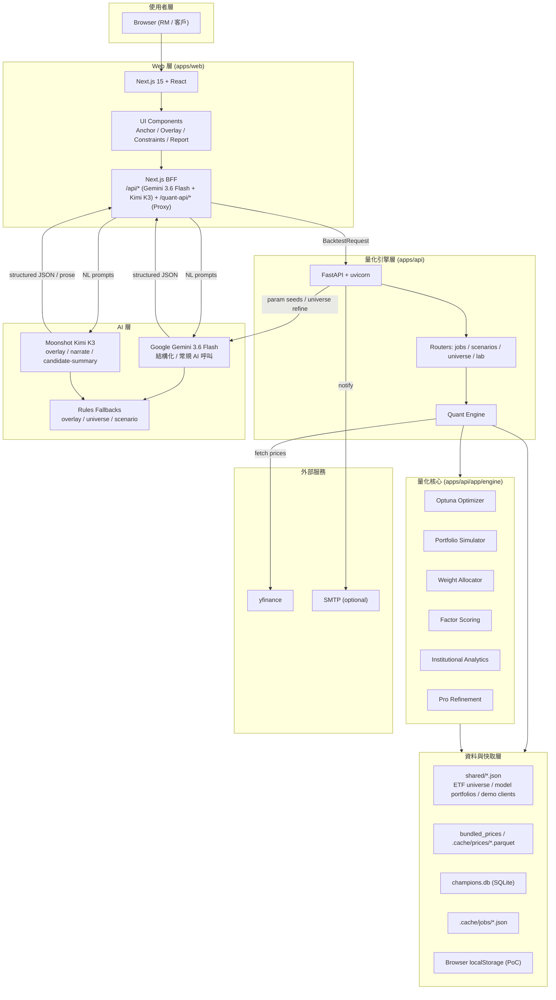
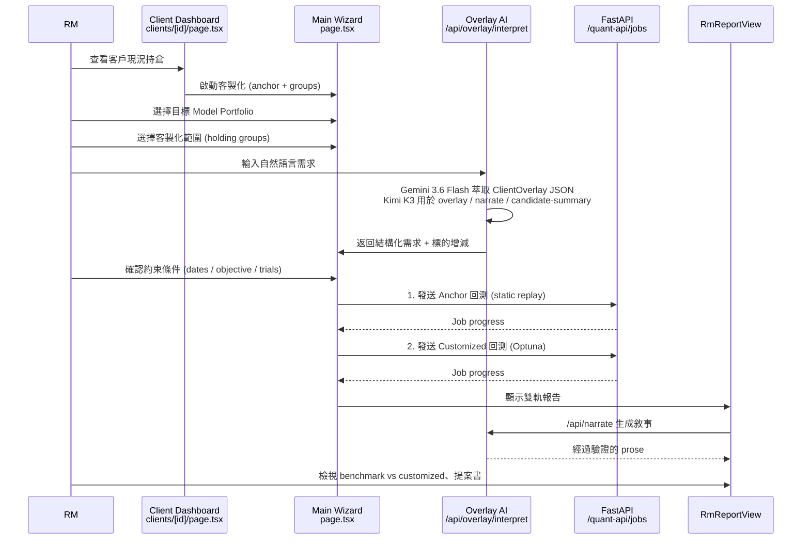
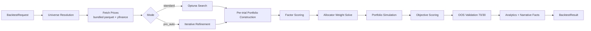

# JASPER AI 系統架構圖

> 由 Cursor agent 依目前程式碼結構自動整理，自由格式。

---

## 1. 整體系統架構

---

## 2. 典型 RM 使用流程資料流

---

## 3. 量化引擎內部流程

---

## 4. 技術棧對照

| 層級 | 技術 | 負責內容 |
|---|---|---|
| 前端 | Next.js 15, React, Tailwind, Recharts | UI wizard、圖表、i18n |
| BFF | Next.js Route Handlers | Gemini 3.6 Flash + Kimi K3 路由、API Proxy |
| 後端 | FastAPI + uvicorn | 回測任務、進度、資料 API |
| 量化 | Optuna, pandas, numpy | 優化、模擬、配置 |
| AI | Google Gemini 3.6 Flash + Moonshot Kimi K3 | 3.6 Flash 負責結構化萃取、常規參數建議；Kimi K3 負責 overlay / narrate / candidate-summary 等高價值推理 |
| 資料 | SQLite, Parquet, JSON | 冠軍註冊、價格快取、靜態資料 |
| 外部 | yfinance, SMTP | 市場資料、郵件通知 |

---

## 5. 混合模型配置 (Hybrid Model Assignment)

系統目前採用雙模型策略，依任務特性分派最適合的 LLM：

- **Kimi K3**（Moonshot）：用於高價值推理任務，例如 `overlay` 自然語言理解、`narrate` 敘事生成、`candidate-summary` 候選組合摘要。這類任務需要更強的語意理解與生成品質。
- **Gemini 3.6 Flash**（Google）：用於結構化、可重複且對延遲敏感的常規 AI 呼叫，例如 `ClientOverlay` JSON 萃取、參數建議、universe refinement 等。這類任務需要穩定的 JSON 輸出與較低成本。
- 兩者皆受相同的 Rules Fallback 與 `validateNarrative()` 檢查約束，確保數學指標仍由量化引擎產生，不會由 LLM 幻覺推導。

---

## 6. 設計原則

> **數學引擎算數字，LLM 只寫敘事。**

- Gemini 不直接計算報酬、權重、風險指標
- 所有數字由 Python 量化引擎產生
- LLM 僅用於自然語言理解、敘事生成、參數建議
- 產出前經過 `validateNarrative()` 零幻覺檢查
