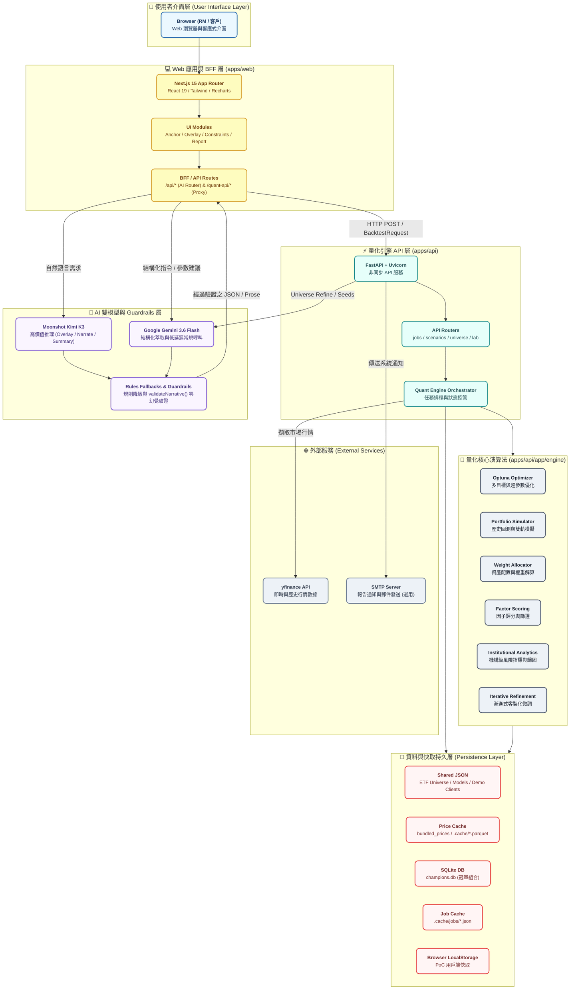
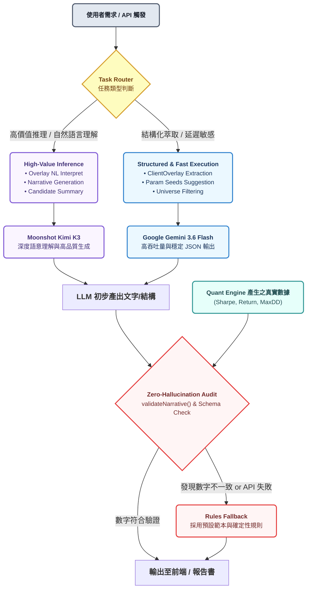
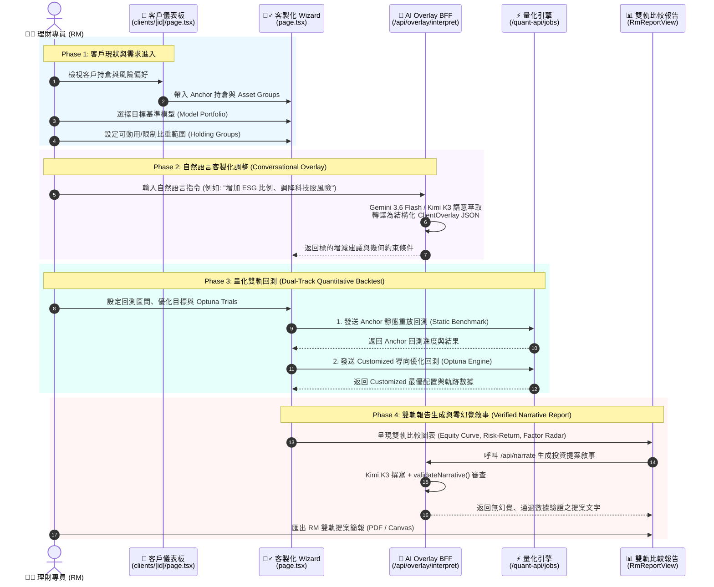

# JASPER AI 系統架構圖與資料流說明 (JASPER AI System Architecture)

> 本文件為 **JASPER AI 量化理財助理** 之完整系統架構、AI 雙模型分工、RM 工作流程與量化核心管道說明。
> 圖表皆採用高可讀性之 Mermaid.js 語法繪製，具備清楚的視像分層 (`classDef`)、適當字型大小與節點間距，方便直接複製或匯出至官方簡報與企劃書。

---

## 1. 整體系統分層架構 (High-Level System Architecture)

下圖展示系統由前端 UI / BFF、後端量化引擎、AI 雙模型路由、資料持久層至外部服務的整體架構：

---

## 2. AI 雙模型路由與 Zero-Hallucination 驗證流程 (AI Routing & Guardrail Flow)

系統採用**混合模型分派策略 (Hybrid Model Assignment)**，並搭配強化的零幻覺審查機制：

---

## 3. 典型 RM 使用流程資料流 (Sequence Diagram)

此時序圖涵蓋理財專員 (RM) 從查看客戶現況持倉、選擇 Model Portfolio、輸入自然語言客製化調整（Conversational Overlay）、發動雙軌 Optuna 回測，到最終生成報告書的完整階段：

---

## 4. 量化引擎內部演算管道 (Quant Engine Core Pipeline)

展示量化引擎從接收 `BacktestRequest` 開始，進行 Universe 篩選、行情讀取、Optuna 多目標搜尋、因子評分、資產配置權重解算、樣本外 (OOS) 驗證至輸出 `BacktestResult` 的完整邏輯：

```mermaid
flowchart LR
    classDef startEnd fill:#E2E8F0,stroke:#4A5568,stroke-width:2px,color:#1A202C,font-size:12px,rx:6px,ry:6px;
    classDef process fill:#EBF8FF,stroke:#3182CE,stroke-width:2px,color:#1A365D,font-size:12px,rx:6px,ry:6px;
    classDef decision fill:#FEFCBF,stroke:#D69E2E,stroke-width:2px,color:#744210,font-size:12px,rx:6px,ry:6px;
    classDef optuna fill:#FAF5FF,stroke:#805AD5,stroke-width:2px,color:#44337A,font-size:12px,rx:6px,ry:6px;
    classDef calc fill:#E6FFFA,stroke:#319795,stroke-width:2px,color:#234E52,font-size:12px,rx:6px,ry:6px;
    classDef valid fill:#FFF5F5,stroke:#E53E3E,stroke-width:2px,color:#742A2A,font-size:12px,rx:6px,ry:6px;

    A["<b>BacktestRequest</b><br/>參數與約束條件"] --> B["<b>Universe Resolution</b><br/>標的篩選與權重界限"]
    B --> C["<b>Fetch Prices</b><br/>bundled_prices + yfinance"]
    
    C --> D{"<b>Execution Mode</b>"}
    
    D -->|Standard Mode| E["<b>Optuna Optimizer</b><br/>多目標採樣搜尋"]
    D -->|Pro Auto Mode| F["<b>Iterative Refinement</b><br/>漸進式收斂微調"]
    
    E --> G["<b>Portfolio Construction</b><br/>組合建構與約束扣除"]
    F --> G
    
    G --> H["<b>Factor Scoring</b><br/>動量/品質/波動度評分"]
    H --> I["<b>Weight Allocator</b><br/>二次規劃/極值解算"]
    I --> J["<b>Portfolio Simulation</b><br/>歷史重演與再平衡"]
    J --> K["<b>Objective Scoring</b><br/>Sharpe/Sortino/Drawdown 評分"]
    
    K --> L["<b>OOS Validation</b><br/>70/30 樣本外交叉驗證"]
    L --> M["<b>Institutional Analytics</b><br/>夏普/最大回撤/VaR/歸因"]
    M --> N["<b>BacktestResult</b><br/>結構化結果與事實表"]

    class A,N startEnd;
    class B,C process;
    class D decision;
    class E,F optuna;
    class G,H,I,J,K calc;
    class L,M valid;
```

---

## 5. 技術棧與元件職責表 (Tech Stack & Responsibilities)

| 層級 | 技術 Stack | 核心職責 |
|---|---|---|
| **前端 (Frontend)** | Next.js 15, React 19, Tailwind CSS, Recharts | 客戶選擇、交互式 Wizard、資產配置圖表、多語系 (i18n) |
| **BFF / API Gateway** | Next.js App Router (Route Handlers) | AI 模型分流路由、`validateNarrative()` 稽核、FastAPI 代理 |
| **量化後端 (API)** | FastAPI, Uvicorn, Asyncio | 非同步回測任務管理、進度 Polling/Streaming、歷史組合資料 API |
| **量化核心 (Quant Core)** | Optuna, pandas, numpy, scipy | 多目標幾何優化、因子評分、二次規劃權重解算、70/30 OOS 驗證 |
| **AI 雙模型 (LLM)** | Moonshot Kimi K3 + Google Gemini 3.6 Flash | **Kimi K3** 負責高價值推理與敘事，**Gemini 3.6 Flash** 負責低延遲萃取與常規呼叫 |
| **資料與快取 (Data)** | Parquet, SQLite, JSON | 價格時序快取 (`.parquet`)、冠軍模型庫 (`champions.db`)、Job JSON |
| **外部數據與服務** | yfinance API, SMTP | 實時/歷史市場行情自動補充、報告寄送 (選用) |

---

## 6. 混合模型分工策略 (Hybrid Model Assignment Strategy)

系統採用雙 LLM 混合策略，確保系統兼具**高語意理解品質**與**極致回應速度/成本控制**：

1. **Moonshot Kimi K3**：
   - **應用場景**：`overlay` 自然語言對話理解、`narrate` 投資報告敘事生成、`candidate-summary` 候選組合比較摘要。
   - **優勢**：強大推理能力，能精準捕捉客戶口語化的理財意圖並轉換為高質量的專業投資顧問報告。
2. **Google Gemini 3.6 Flash**：
   - **應用場景**：`ClientOverlay` 結構化 JSON 萃取、`param-seeds` 參數種子建議、`universe/filter` 標的過濾與標準化指令。
   - **優勢**：極低的 Token 延遲與高度穩定的 JSON Schema 遵從率。
3. **Rules Fallback & 雙重保護機制**：
   - 無論選用何種 LLM，所有產出均經過 `validateNarrative()` 審查，若偵測到數字幻覺或 API 逾時，自動無縫降級至預設規則範本 (Rules Fallbacks)。

---

## 7. 核心設計原則與品質驗證 (Core Design Principles)

> **「數學引擎算數字，LLM 只寫敘事。」**

- **數據嚴謹性**：Gemini / Kimi 不參與報酬率、夏普比率、權重、波動度等任何數學公式的計算。
- **事實表鎖定**：所有數字皆由 Python 量化引擎計算並產生 Facts Table，LLM 僅能引用 Facts Table 內的真實數據進行寫作。
- **零幻覺檢查 (Zero-Hallucination Audit)**：`validateNarrative()` 自動比對報告文字中的數值與 Python 算出的數值，確保 100% 精準無誤。
- **雙軌可比性 (Dual-Track Benchmark)**：永遠同時提供 **Anchor (原始/基準)** 與 **Customized (客製化)** 兩套雙軌結果，讓 RM 與客戶能直觀比較改動前後的實質差異。
